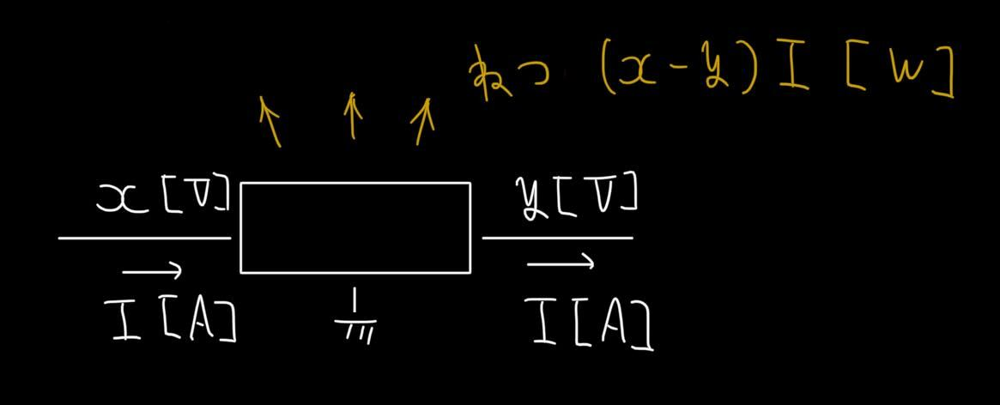
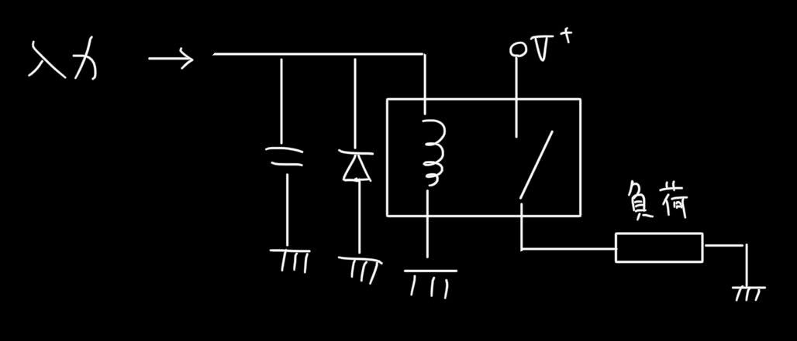
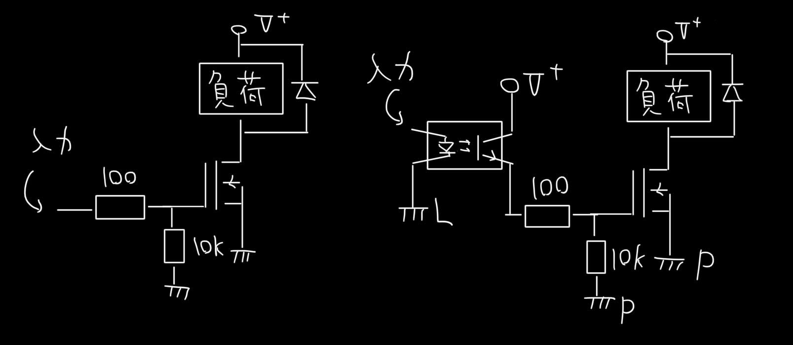

# CREATE 回路資料 パワー関係
前提知識...プルアップ・プルダウン、高校物理電磁気

# 電圧変換
## シリアルレギュレータ(3端子レギュレータ)
電圧精度...まあまあ　効率...悪　出力...中

放熱をしっかりしないと燃える可能性がある

## スイッチングレギュレータ
電圧精度...悪　効率...良　出力...大(ものによる)

## シャントレギュレータ （研究開発段階）
電圧精度...最良　効率...悪？　出力...小

ADCやセンサのリファレンス電圧に用いる

## 絶縁スイッチングレギュレータ
パワー系の電源とロジック系の電源を絶縁したいが、電源は1つにしたい場合に用いる。ノイズ源っぽい？

# 電力制御
## リレー
電磁石により物理的に電源の開閉を行う

適用例…GSE電装...中継基板...キースイッチ

## Nch MOSFET
Nch MOSFETにより負荷をON・OFFする。フォトカプラを前段に追加することでロジックとパワーを絶縁することができる。

左適用例…GSE電装...ステムシステム中継基板

右適用例…GSE電装...バルブシステム中継基板