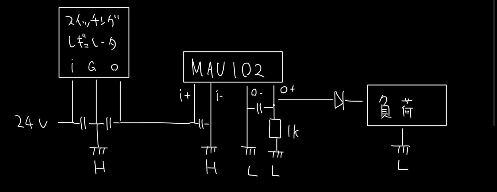

# CREATE 回路資料 パワー関係
前提知識...プルアップ・プルダウン、高校物理電磁気

# 電圧変換
## シリアルレギュレータ(3端子レギュレータ)
電圧精度...まあまあ　効率...悪　出力...中

放熱をしっかりしないと燃える可能性がある

| 適用先            | 型番      | 詳細                                                          | 
| ----------------- | --------- | ------------------------------------------------------------- | 
| ステムGSE中継基板 | NJM7812FA | 30PC030-01030で放熱、電磁弁を繋げて熱的に問題ないことを確認。 | 
| いろいろ | NJW2845 | 様々な基板に 3.3 V, 5 V の電源として採用 | 

## スイッチングレギュレータ
電圧精度...悪　効率...良　出力...大(ものによる)

| 適用先            | 型番      | 詳細         | 
| ----------------- | --------- | ------------ | 
| バルブGSE中継基板 | YDS812    |              | 
| 71L 電源          | BP5293-50 | 研究開発段階 | 

## シャントレギュレータ （研究開発段階）
電圧精度...最良　効率...悪？　出力...小

ADCやセンサのリファレンス電圧に用いる

## 絶縁スイッチングレギュレータ
パワー系の電源とロジック系の電源を絶縁したいが、電源は1つにしたい場合に用いる。ノイズ源っぽい？

| 適用先                    | 型番   | 詳細                                                                                               | 
| ------------------------- | ------ | -------------------------------------------------------------------------------------------------- | 
| バルブGSEコントローラ基板 | MAU102 | 並列に1k抵抗を接続することで低負荷時の昇圧を防止、ダイオードを介しXIAO ESP32C3の電源として用いる。 | 
| バルブGSE中継基板         | MAU102 | NJW2845で3.3Vに降圧、ESP32 WROOM32の電源として用いる。                                             | 

# 電力制御
## リレー
電磁石により物理的に電源の開閉を行う

| 適用先            | 型番          | 詳細                                            | 
| ----------------- | ------------- | ----------------------------------------------- | 
| ステムGSE中継基板 | G4A-1A-E DC24 | キースイッチによりGSEパワー系の電源の開閉を行う | 
| バルブGSE中継基板 | 同上          | 同上                                            | 

バルブGSEにてキースイッチ開時に突入電流の存在を確認、防止のためキースイッチに直列に抵抗の挿入を検討中

## Nch MOSFET
Nch MOSFETにより負荷をON・OFFする。フォトカプラを前段に追加することでロジックとパワーを絶縁することができる。

| 適用先            | 型番                       | 詳細                   | 
| ----------------- | -------------------------- | ---------------------- | 
| ステムGSE中継基板 | TK5R3A06PL                 | イグナイタ・電磁弁制御 | 
| バルブGSE中継基板 | TK5R3A06PL & TLP785(GB F)  | イグナイタ制御         | 
| バルブGSE中継基板 | MTB30N06I3  & TLP785(GB F) | 電磁弁制御             | 