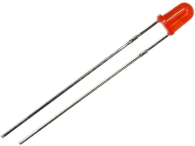
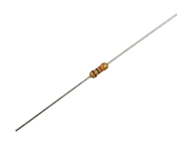
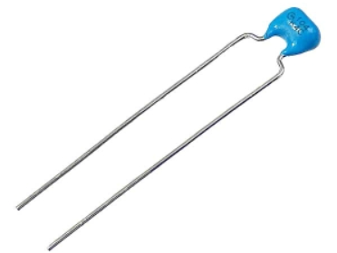
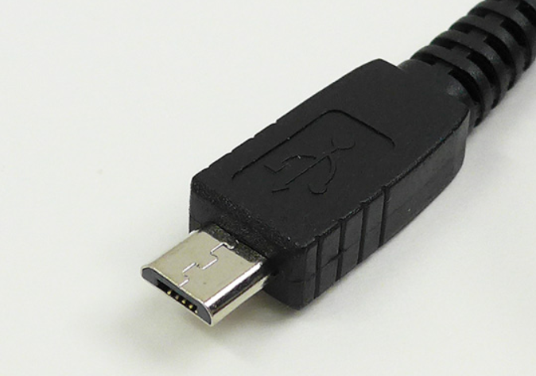
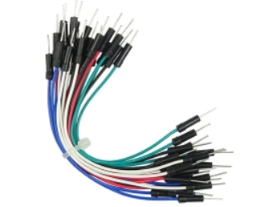
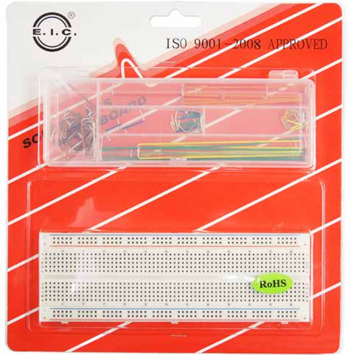
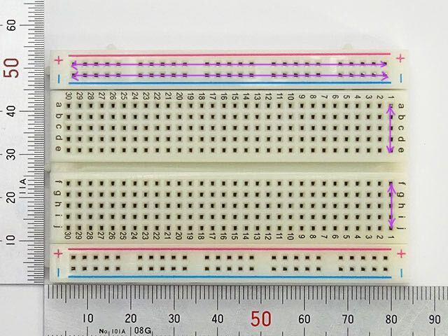

# 教育物品リスト
配布する物品のリストを以下に示す。
|  名称  |  個数 |　詳細 |
| ---- | ---- | ---- |
|  LED  |  1  |　 |
|  抵抗  |  10前後  |　10kΩ(茶黒橙金) |
|  セラミックコンデンサ  |  10  |　0.1uF |
|  マイコンボード  |  1  |　ESP32-DevKitC-32E |
|  USBケーブル  |  2  |　microB |
|  ジャンプワイヤ  |  たくさん  |　 |
|  ブレッドボードセット |  1  |　 |
|  シリアル変換モジュール  |  1  | FT234X |
|  サーボ  |  1  | SG90 |
|  GPSモジュール  |  1  | AE-GYSFDMAXB |

# 物品についての説明

## LED

発光するダイオード、極性があり、長い足（アノード）をプラスに、短い足（カソード）をマイナスにつなぐ。

電装班では、プラスのことを電源電位と呼ぶ。これは 3.3 Vや 5 V、12 Vであることが多い。また、マイナスについてはGNDや基準電位と呼ぶ。

## 抵抗

オームの法則 `V=IR` に従う部品であり、多目的に使用される。色の並びは`R`の値を示す。値を調べるにはGoogle検索をしてもよいし、スマートフォンのアプリを使ってもよい。

## コンデンサ

電荷を蓄える部品。多目的に使用される。

## マイコンボード

Wi-FiとかBluetoothとかも積んでおり、いろいろなことができるマイコンボード。最近1200円から1600円に値上げされた。

## USBケーブル

マイコンボードとPCを接続するためのケーブル。

## ジャンプワイヤ

ブレッドボード配線用。

## ブレッドボードセット

ブレッドボードと配線材料がセットになっている。配線材料を用いると配線がスッキリする。

ブレッドボード内部はこのようにつながってる

## シリアル変換モジュール

UART通信で使う。
ピンを曲げやすいので注意。
踏むとめっちゃ痛い。

## サーボ

PWMで制御できるモーター。うるさい。図書館で回すと顰蹙を買うことになる。

## GPSモジュール

GPSからの電波を受信し、位置情報を出力するモジュール。生産終了しておりそろそろ入手できなくなりそう。
